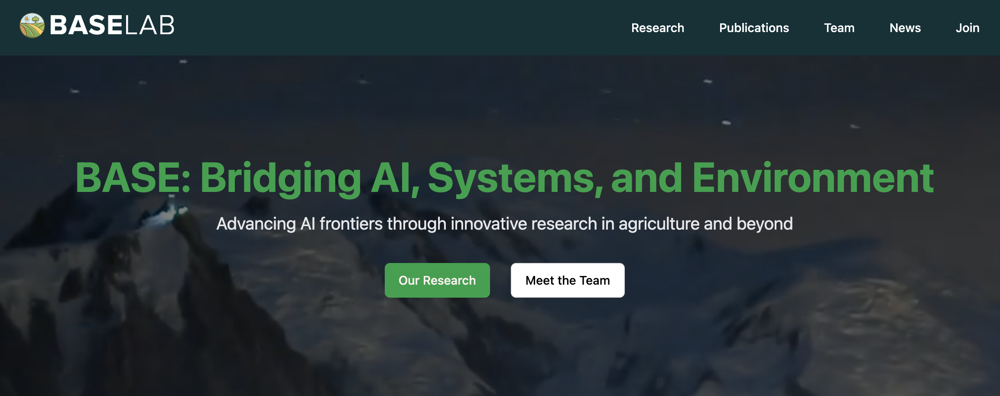

<!-- Banner -->
<div align="center">
  
  <h1>BASE LAB: Bridging AI, Systems, and Environment</h1>
  <p>🚀 A cutting-edge research lab website built with Next.js and modern web technologies</p>
  
  <!-- Badges -->
  <p>
    <a href="https://nextjs.org">
      
    </a>
    <a href="https://reactjs.org">
      
    </a>
    <a href="https://tailwindcss.com">
      
    </a>
    <a href="https://typescriptlang.org">
      
    </a>
  </p>
</div>

---

## 📋 Table of Contents

- [Features](#-features)
- [Screenshots](#-screenshots)
- [Getting Started](#-getting-started)
- [Project Structure](#-project-structure)
- [Updating the Website](#-updating-the-website)
- [Git Workflow](#-git-workflow)
- [Deployment](#-deployment)
- [Contributing](#-contributing)
- [Resources](#-resources)

---

## 🌟 Features

- 💻 **Modern Stack** - Built with Next.js 14, React 18, and TypeScript
- 🎨 **Beautiful UI** - Sleek design with Tailwind CSS and Shadcn UI components
- 📱 **Fully Responsive** - Perfect display on all device sizes
- 🚀 **Optimized Performance** - Lightning-fast page loads with static generation
- 📊 **Dynamic Content** - JSON-based content management for easy updates
- 🖼️ **Media Rich** - Supports images, videos, and interactive elements
- 🔍 **SEO Ready** - Optimized structure for search engines
- 🧩 **Component-Based** - Modular architecture for easy maintenance

## 📸 Screenshots

<div align="center">
  
</div>

## 🚀 Getting Started

### Prerequisites

- Node.js 18+ and npm/yarn

### Installation

1. **Clone the repository**
   ```bash
   git clone https://github.com/yourusername/base-lab-next.git
   cd base-lab-next
   ```

2. **Install dependencies**
   ```bash
   npm install
   # or
   yarn install
   ```

3. **Start the development server**
   ```bash
   npm run dev
   # or
   yarn dev
   ```

4. **View the website**
   Open [http://localhost:3000](http://localhost:3000) in your browser

## 🧰 Project Structure

```
base-lab-next/
├── app/               # Next.js pages and routes
├── components/        # Reusable UI components
├── lib/               # Utility functions
├── public/            # Static assets and JSON data
│   ├── images/        # Image assets
│   ├── videos/        # Video assets
│   └── *.json         # Content data
└── styles/            # Global styles
```

## 📘 Updating the Website

This comprehensive guide will help new maintainers update and manage the BASE Lab website.

### Content Management System

The website uses JSON files in the `public/` directory as its content database:

#### Key Data Files

- `home.json` - Home page content (hero section, research areas, stats, carousel items)
- `team.json` - Team member profiles and information
- `publications.json` - Research publications organized by year
- `news.json` - News and events items
- `research.json` - Research project details

### Adding & Updating Content

#### Team Members

Edit `public/team.json` and add a new entry with this structure:

```json
{
  "name": "New Member Name",
  "title": "PhD Student",
  "email": "email@example.com",
  "image": "/images/team/newmember.jpg",
  "bio": "Short biography text here...",
  "research": ["Computer Vision", "Deep Learning"],
  "links": {
    "google_scholar": "https://scholar.google.com/...",
    "github": "https://github.com/...",
    "linkedin": "https://linkedin.com/in/..."
  }
}
```

#### News Items

Edit `public/news.json` and add a new entry at the beginning:

```json
{
  "title": "News Item Title",
  "date": "January 1, 2025",
  "description": "Description of the news item...",
  "badge": "Event/Publication/Award",
  "image": "/images/news/image.jpg"
}
```

#### Publications

Edit `public/publications.json` to add new publications:
- Publications are organized by year
- Add a new year section if necessary
- Each publication includes title, authors, publisher, DOI, etc.

Additionally, update the BibTeX file (`public/publication.bib`) with new entries.

#### Adding Images

1. **Image directory locations:**
   - Team photos: `public/images/team/`
   - Carousel slides: `public/images/slider/`
   - Sponsor logos: `public/images/sponsors/`

2. **Image preparation guidelines:**
   - Team photos: Square format (1:1 ratio)
   - Carousel slides: 16:9 ratio recommended
   - Sponsor logos: Transparent PNG files
   - Use compressed images for better performance

3. After adding images, update the corresponding JSON file references.

### Modifying Website Pages

#### Home Page
- Edit `app/page.tsx` for layout changes
- Content comes from `public/home.json`

#### Team Page
- Edit `app/team/page.tsx` for layout changes
- Data comes from `public/team.json`

#### Publications Page
- Edit `app/publications/page.tsx` for layout changes
- Data comes from `public/publications.json`

#### Research Page
- Edit `app/research/page.tsx` for layout changes
- Data comes from `public/research.json`

#### News Page
- Edit `app/news/page.tsx` for layout changes
- Data comes from `public/news.json`

#### Join Page
- Edit `app/join/page.tsx` directly to update content

### UI Components

1. **Navigation:** Edit `components/NavBar.tsx` to update navigation links
2. **Footer:** Edit `components/Footer.tsx` for footer information
3. **Carousel:** Edit `components/CarouselWithAutoplay.tsx` for carousel behavior
4. **UI Library:** Common components in `components/ui/` (Shadcn UI)

### Styling and CSS

1. **Global Styles:** Edit `app/globals.css`
2. **Tailwind Configuration:** Edit `tailwind.config.ts`
3. **Page-specific Styles:** Some pages have module CSS files (e.g., `page.module.css`)

## 🔀 Git Workflow

Always use branches for new features or updates to maintain a stable main branch.

### Creating a New Branch

1. **Get the latest version of main:**
   ```bash
   git checkout main
   git pull origin main
   ```

2. **Create and switch to a new branch:**
   ```bash
   git checkout -b feature/your-branch-name
   ```
   Use descriptive names like `feature/update-team` or `fix/carousel-display`

3. **Make your changes** to the website

4. **Commit your changes:**
   ```bash
   git add .
   git commit -m "Description of changes"
   ```

5. **Push your branch to GitHub:**
   ```bash
   git push -u origin feature/your-branch-name
   ```

### Merging Changes to Main

#### Option 1: GitHub Pull Request (Recommended)

1. Go to the repository on GitHub
2. Click "Pull requests" → "New pull request"
3. Set base branch to `main` and compare branch to your feature branch
4. Click "Create pull request"
5. Add title and description
6. Request reviews if needed
7. After review, click "Merge pull request"

#### Option 2: Command Line Merge

1. **Switch to main branch:**
   ```bash
   git checkout main
   ```

2. **Get latest changes:**
   ```bash
   git pull origin main
   ```

3. **Merge your branch:**
   ```bash
   git merge feature/your-branch-name
   ```

4. **Resolve conflicts** if needed

5. **Push to GitHub:**
   ```bash
   git push origin main
   ```

## 🚀 Deployment

### Building for Production

1. **Create a production build:**
   ```bash
   npm run build
   ```

2. **Test the production build locally:**
   ```bash
   npm run start
   ```

### Deployment Options

This project is optimized for deployment on Vercel:
1. Push to your GitHub repository
2. Connect to Vercel
3. Deploy with a single click

Other options include GitHub Pages, Netlify, or any static hosting service.

## 🔧 Troubleshooting

Common issues and solutions:

1. **Development server problems:**
   - Delete `.next` folder and restart: `rm -rf .next && npm run dev`

2. **Dependencies issues:**
   - Reinstall node modules: `rm -rf node_modules && npm install`

3. **Build errors:**
   - Check console for error messages
   - Verify JSON files have proper formatting

## 📚 Resources

- [Next.js Documentation](https://nextjs.org/docs)
- [Tailwind CSS Documentation](https://tailwindcss.com/docs)
- [Shadcn UI](https://ui.shadcn.com/)

---

<div align="center">
  <p>
    <strong>Designed & Developed with ❤️ by a brilliant research team</strong>
  </p>
  <p>
    © 2024 BASE Lab. All rights reserved.
  </p>
</div>
